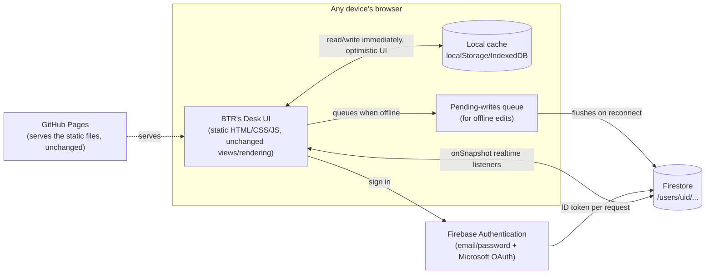

# BTR's Desk — Multi-User Scaling Plan

Status: **planning only — nothing in this document has been built.** This is
the reference to work from when the decision is made to move BTR's Desk from
a single-user, browser-only tool to a real multi-user product with accounts
and cross-device sync.

Recommended stack: **Firebase Authentication + Firestore**, static frontend
kept on **GitHub Pages**. Rationale is in the chat history that produced this
doc; the short version is: free at this app's scale, per-user data isolation
is a config (security rules) instead of a server you write and maintain, and
Firebase Auth's Microsoft OAuth provider means Deloitte-style SSO is a
checkbox, not a project.

---

## 1. What's needed

### Accounts / services to create
- A Google account to own the Firebase project (can be personal or a new one
  dedicated to this app — don't hang a multi-user product off a personal
  Google account you don't want tied to it long-term).
- A Firebase project, Spark (free) plan to start.
- Firebase Authentication enabled, with at minimum:
  - Email/password provider, and/or
  - Microsoft (Azure AD) OAuth provider, if Deloitte-colleague sign-in matters
- Firestore Database, in **Native mode** (not Datastore mode), region chosen
  once and never changed.
- (Optional, later) A lightweight client-error reporting sink — either a free
  Sentry project, or a simple `errors` collection in Firestore written to
  from a `window.onerror` handler. Nothing exists for this today.

### New dependencies
- Firebase JS SDK (`firebase-app`, `firebase-auth`, `firebase-firestore`),
  loaded the same way the app already loads Google Fonts — pinned version,
  from the CDN allowlist available at the time, or self-hosted if the
  eventual hosting setup doesn't allow the Firebase CDN.
- `@firebase/rules-unit-testing` (dev-only, for security-rule tests) and the
  **Firebase Local Emulator Suite** (Auth + Firestore emulators) for
  development without touching the real project.
- No new server runtime, no new hosting bill — the frontend stays static.

### Non-functional requirements (the actual bar for "done")
1. A user's data is never visible to another user, under any code path,
   verified by rule tests, not just by trusting the client.
2. No data loss on a flaky connection: a change made offline is queued and
   applied once connectivity returns, never silently dropped.
3. Opening the app on a second device shows the same data without any manual
   export/import step (this plan retires that as the primary workflow, though
   it stays available in the app as a personal-machine sync fallback).
4. Stays inside Firebase's free (Spark) tier at the expected usage of a small
   number of real users; if that ever looks likely to change, that's a
   decision point, not a silent bill.
5. Every feature that exists today (Today/Upcoming, Notes, Calendar
   Month/Week/Day, Analysis charts, Focus mode, project drag-reorder,
   task drag-reschedule, task-time alerts, Persist-to-notes, Completed
   bucket, search) keeps working exactly as it does now — this is a storage
   swap, not a feature rewrite.

---

## 2. Target architecture

In words, since diagram rendering support varies by viewer:

- **GitHub Pages** keeps serving the static app files, unchanged.
- The **browser** (any device) runs the same UI as today, but now backed by
  two things instead of `localStorage` alone: a **local cache** (instant,
  optimistic reads/writes, same feel as today) and a **pending-writes queue**
  that holds edits made while offline until they can be flushed.
- The UI signs the user in through **Firebase Authentication**
  (email/password and/or Microsoft OAuth), which issues an ID token.
- Every read/write — both the live ones and the queued/offline ones once
  flushed — goes to **Firestore**, scoped to that user's own document tree
  (`/users/{uid}/...`), with **Security Rules** enforcing on the server side
  that a token for uid A can never touch uid B's data.
- Firestore's `onSnapshot` listeners push changes back down to every device
  signed into that account in real time, which is what makes multi-device
  sync automatic instead of a manual export/import step.



*(If the diagram above shows as plain text or an error instead of a chart,
your viewer doesn't render Mermaid — the prose description above it and the
data-model table below cover the same ground.)*

### Components
| Piece | Role | Changes from today |
|---|---|---|
| GitHub Pages | Hosts the static app | None — still just files |
| App shell (`index.html`/`style.css`) | UI structure | None — same views, same components |
| `app.js` render/interaction logic | Rendering, drag-drop, modals, focus mode, calendar, analysis | Unchanged — only the storage layer underneath it is swapped |
| **New:** storage layer | Currently `load()`/`save()` against `localStorage` | Rewritten to read/write Firestore, with `localStorage`/IndexedDB kept as a local cache + offline queue |
| **New:** auth gate | None today | A sign-in screen shown before the app renders; the app never runs signed-out |
| Firebase Auth | New | Owns identity, issues tokens |
| Firestore | New | Owns durable, per-user data |

### Data model
One document tree per user, everything scoped under it so the security rule
is a single line:

```
/users/{uid}                         profile doc: { displayName, email, capacity, createdAt }
/users/{uid}/projects/{projectId}    { name, color, order }
/users/{uid}/tasks/{taskId}          { title, projectId, priority, time, date, startTime,
                                        taskNotes, done, focusStartedAt, actualSeconds }
/users/{uid}/notes/{noteId}          { title, date, projectId, attendees, points[], actions[] }
/users/{uid}/sessions/{sessionId}    { taskId, title, projectId, date, seconds }
```

This is a near 1:1 mapping of the current `state.projects` / `state.tasks` /
`state.notes` / `state.sessions` arrays — each array becomes a subcollection,
each array element becomes a document. Minimal reshaping, which keeps the
migration script simple and keeps `app.js`'s rendering code largely untouched
(it already thinks in terms of these four lists).

### Security rules (the enforcement point — not optional, not "trust the client")
```
rules_version = '2';
service cloud.firestore {
  match /databases/{database}/documents {
    match /users/{uid}/{document=**} {
      allow read, write: if request.auth != null && request.auth.uid == uid;
    }
  }
}
```
Every rule change gets a unit test (see Testing Plan) before it ships —
this is the one place a mistake leaks one user's data to another.

### Sync & offline strategy
- Firestore's own offline persistence (`enableIndexedDbPersistence`) handles
  the bulk of this for free: reads come from cache when offline, writes queue
  and flush automatically on reconnect, and the SDK already deduplicates.
- UI stays optimistic: a change is applied to local state and rendered
  immediately (as it is today), then persisted — the user never watches a
  spinner to see their own edit.
- Conflict policy: **last write wins**, at the document (single task/note)
  level. Deliberately not building CRDTs/operational transforms — this is a
  personal productivity tool, not a collaborative editor, and last-write-wins
  at the single-task granularity means two devices editing *different* tasks
  never conflict at all; the only real collision is editing the *same* task
  on two devices in the same few seconds, which is an edge case worth
  accepting rather than engineering around.
- Multi-tab-same-device stays in sync too, for free, via the same
  `onSnapshot` listeners — closes a small gap that exists even today (two
  tabs on one machine don't currently notice each other's changes without a
  reload).

### Auth flow
1. App loads → checks Firebase Auth state.
2. Signed out → render a sign-in screen only (no task data fetched or shown).
3. Signed in → fetch the four subcollections once, attach `onSnapshot`
   listeners for live updates, then render exactly as today.
4. Sign-out clears local listeners and cache, returns to step 2.

---

## 3. Implementation plan

Phased so each phase ships something verifiable, and phase 1–2 can happen
entirely against the Firebase emulator without touching real user data.

| Phase | Deliverable | Depends on |
|---|---|---|
| 0 | Firebase project created (dev + prod, see Development Plan), Auth providers enabled, Firestore created, security rules written and unit-tested against the emulator | — |
| 1 | Storage-layer rewrite: `load()`/`save()` and every other `localStorage` touch replaced by Firestore reads/writes behind the same function names/shapes, so the rest of `app.js` doesn't need to change | Phase 0 |
| 2 | Auth gate UI: sign-in/sign-up screen, session handling, sign-out control | Phase 0 |
| 3 | Offline queue + optimistic UI wiring, connection-status indicator | Phase 1 |
| 4 | One-time data-migration flow: on first sign-in, offer to import whatever is currently in this browser's `localStorage` into the new account | Phase 1, 2 |
| 5 | Full regression pass over every existing feature (see Testing Plan's regression checklist) against the new storage layer | Phase 1–4 |
| 6 | Deployment (see Deployment Plan) | Phase 5 |

---

## 4. Development plan

- **Environments:** two Firebase projects — `btrdesk-dev` (or an emulator-only
  setup for most work) and `btrdesk-prod`. Never develop against prod data.
- **Local dev loop:** Firebase Local Emulator Suite (`firebase emulators:start`)
  running Auth + Firestore locally, `app.js` pointed at the emulator via a
  config flag, same `python -m http.server` / `.claude/launch.json` preview
  workflow already in use for everything else in this repo.
- **Branching:** a single long-lived feature branch (e.g. `multi-user`) off
  `main`, merged only at the end of Phase 5 — `main` stays the current,
  working single-user app the whole time, so there's always something
  deployable if this takes longer than expected.
- **Config/secrets:** Firebase's client config (API key, project ID, etc.) is
  not a secret in the traditional sense — it's meant to ship in the client
  bundle, access control comes from security rules, not from hiding the
  config. Still keep dev vs. prod config in separate, clearly-labeled
  constants so a local test build can never point at prod by accident.
- **Rough effort shape** (not a commitment, just sizing for planning):
  Phase 0 smallest, Phase 1 and 5 largest (rewriting the storage layer, and
  then re-verifying every feature built across this app's whole history).

---

## 5. Testing plan

### Security rules (highest priority — test before anything else)
Using `@firebase/rules-unit-testing` against the emulator:
- A user can read/write their own `/users/{uid}/**`.
- A user **cannot** read or write another uid's documents — assert this
  explicitly, don't just assume the rule works because it looks right.
- An unauthenticated request is rejected outright.

### Storage-layer unit tests
- Each of the four collections: create, update, delete, list — against the
  emulator, not mocks, so a rule regression shows up here too.
- Offline queue: simulate offline (emulator supports this), make a change,
  go back online, assert it landed.

### Full regression checklist (manual, against the emulator, then again
against dev before prod cutover) — every feature this app currently has:
- [ ] Create/edit/delete a task, a note, a project
- [ ] Today's capacity bar, Overdue chip
- [ ] Upcoming grouped-by-date, collapsible date groups
- [ ] Drag a task to a different date (list views)
- [ ] Calendar: Month/Week/Day modes, drag-to-reschedule, click-to-edit
- [ ] Project page: Tasks/Notes toggle, drag-reorder projects by handle
- [ ] Completed bucket + Clear bucket
- [ ] Focus mode: start/complete/cancel, actual-vs-estimate badge
- [ ] Analysis: donut + trend chart, Day/Month/Year granularity
- [ ] Task time + browser notification at scheduled time
- [ ] "Notes for this task" + Persist to a real note
- [ ] Search, `/` shortcut
- [ ] Sidebar resize/collapse
- [ ] Export/Import (kept as a fallback — see Deployment Plan)
- [ ] Enter-to-save in every modal, Escape-to-close

### Cross-device / cross-browser matrix
- Sign in as the same user on two different browsers (or a browser + a
  private window with a second test account) — confirm both see the same
  data, and a change on one appears on the other without a manual reload.
- One device offline (airplane mode / devtools "offline"), make edits,
  reconnect, confirm they land and the other device picks them up.

### Multi-user isolation test (do this for real, not just via rule unit tests)
- Two real test accounts, confirm neither can see the other's projects even
  by manually poking the Firestore console/API with the wrong uid.

---

## 6. Deployment plan

1. **Keep `main` on the current single-user app** until Phase 5 is fully
   green — nothing about this rollout should risk today's working app.
2. **Staged rollout:** deploy the `multi-user` branch to a separate path or a
   Firebase Hosting preview channel first (or a second GitHub Pages
   repo/branch) so it's reachable at its own URL without touching the live
   one.
3. **Data migration UX:** first sign-in on a browser that has existing
   `localStorage` data offers "Import your existing data into this account?"
   — reuses the *exact* import logic already built for the manual
   export/import feature, just pointed at Firestore instead of a file.
4. **Cutover:** once the staged version has had a real soak (see Post-
   Deployment Testing Plan) merge to `main`, so the existing hosted URL now
   serves the multi-user version.
5. **Rollback plan:** because `main` was untouched until cutover, rollback is
   a `git revert` of the merge commit back to the last single-user commit —
   verify this actually works (tag the last single-user commit before
   merging, don't rely on finding it later in history).
6. **Keep Export/Import in the app** even after this ships — it's now a
   personal safety net (a user's own downloadable copy of their data) rather
   than the only way to move between machines.

---

## 7. Post-deployment testing plan

Run this checklist immediately after the production cutover, against the
real (prod) Firebase project, with a real (or dedicated test) account:

- [ ] Sign-in works end-to-end (both providers, if both are enabled)
- [ ] A brand-new account gets the seed project/task/note, same as today's
      "example project" first-run experience
- [ ] Existing single-user data (if migrating your own real data) imports
      correctly and completely — spot-check counts of tasks/notes/projects
      before and after
- [ ] Create/edit/delete a task and a note, confirm both persist across a
      full sign-out/sign-in cycle
- [ ] Open the app on a second device/browser with the same account,
      confirm the data matches
- [ ] Kill connectivity, make an edit, restore connectivity, confirm it syncs
- [ ] Attempt (deliberately, from devtools) to read another test account's
      data — confirm it's denied
- [ ] Confirm Firebase console shows reads/writes landing as expected, and
      usage is nowhere near the free-tier ceiling

**Soak period:** keep the pre-migration single-user version's URL/commit
tag reachable for a defined window (e.g. one to two weeks) after cutover, in
case something surfaces only under real usage.

---

## 8. Monitoring plan

Nothing like this exists today (the app has never had a backend to
monitor) — this is new surface, kept as light as the rest of the project.

| What | Where | Why |
|---|---|---|
| Auth sign-in success/failure rate | Firebase Console → Authentication | Catches a broken OAuth config or a provider outage |
| Firestore reads/writes/deletes vs. free-tier quota | Firebase Console → Firestore → Usage | Firebase's Spark plan has a daily free quota (check the current numbers on Firebase's pricing page — they do change); this is what tells you *before* it becomes a bill |
| Firestore rule denials | Firebase Console → Firestore → Rules (audit) | A spike here means either an attempted access-control breach or a client bug hitting the wrong path — both worth knowing immediately |
| Client-side JS errors | New: a minimal `window.onerror`/`onunhandledrejection` hook writing to a small `errors` collection, or a free Sentry project | Nothing currently reports a broken client at all — the syntax-error incident earlier in this app's history would have gone completely unnoticed without someone reporting "it doesn't work" |
| Firebase service status | https://status.firebase.google.com | Distinguishes "our bug" from "their outage" during an incident |
| Cost | Firebase Console → Usage & billing, with a **budget alert** set even while on the free Spark plan (so upgrading to Blaze later, if it ever happens, can't silently run up a bill) | Directly protects the "no cost involved" requirement this whole plan started from |

**Incident response:** for a solo-maintained personal-scale app, "monitoring"
mostly means checking the Firebase console after any change and having the
budget alert as a tripwire — this isn't proposing on-call rotations or
paging, just making sure a real problem doesn't sit invisible.

---

## 9. Risks & open questions

- **Data handling / compliance:** this app would start holding other people's
  meeting notes and task data on Google's Firebase infrastructure, under
  whatever Google account owns the project. If real Deloitte colleagues are
  meant to use this with real work content, that's worth a conscious check
  against your own organization's data-handling expectations before opening
  it up — this plan makes it *technically* possible, it doesn't clear that
  question on its own.
- **Auth provider choice:** email/password vs. Microsoft-only vs. both —
  affects onboarding friction and whether you're maintaining password-reset
  UX at all. Not decided in this document.
- **What happens past the free tier:** fine at small scale; if this grows a
  real user base, Firestore's pay-as-you-go pricing needs a proper look
  before it becomes urgent.
- **True real-time collaboration** (two people editing the *same* shared
  project) is out of scope here — this plan is "one account, many of that
  same person's devices," not "a team tool." Shared/multi-editor projects
  would be a meaningfully bigger design (permissions, presence, real
  conflict resolution) on top of this foundation.
